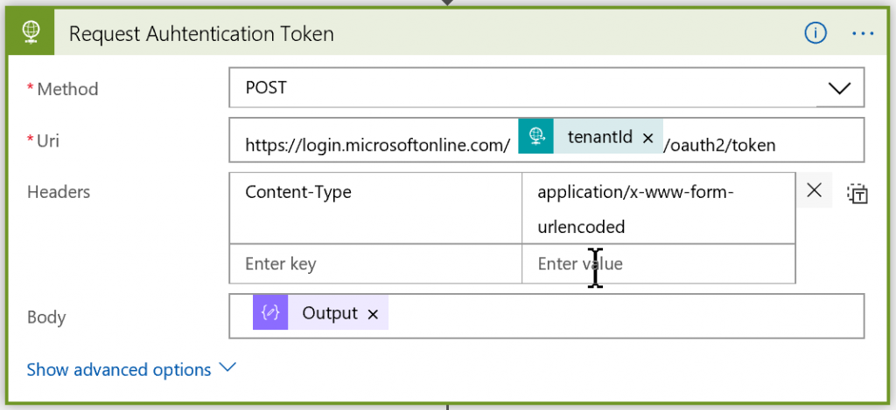

# Automating API Management Backup and Restore with Logic Apps

*Originally posted by [Wagner Silveira](https://twitter.com/wsilveiranz) on [Note to Self](https://notetoself.tech/2018/06/25/automating-api-management-backup-and-restore-with-logic-apps/) Blog*

The following tutorial walks you through setting up a disaster recovery (DR) strategy for a solution that is based on API Management, Azure Functions and Service Bus. Most of the deployment to the secondary site is dealt by VSTS, but one of the main issues could be API Management instance Standard tier, which doesn't allow multi-region deployments. The Management REST API needs to be leveraged to allow backing up all API Management configuration, including users, API policies and subscriptions. The API calls for backup and restore are quite straightforward, but they require an authorization token, which must be requested beforehand. This process can be automated with Azure Logic Apps.

## Preparing the environment

To generate the authorization token, you need a service principal with the right permissions on both primary and secondary resource groups. This [document](https://docs.microsoft.com/en-us/azure/azure-resource-manager/resource-group-create-service-principal-portal) shows how to implement a service principal. Once the service principal is setup, you need to set permissions in a few places:

* Assign delegation permissions to the service principal to access the Azure Management API, so the service principal had permissions to execute the API.
* Assign the correct roles on both the primary and DR resource groups, so the service principal could interact properly with them.

### Assigning delegation permissions

To assign delegation permissions to the service principal, follow the steps below:

1. Within your **Active Directory** tenant navigate to **App Registrations > [YourServicePrincipal] > Settings** (for example, the Service Principal could be called APIM Authentication).
2. Select **Required** permissions.
3. Click on **+Add**.

     

Select the right API to delegate permissions:

1. Click on **Select an API**.
2. Select the **Windows Azure Service Management API** (remember to click **Select** after this).

    

Finally select and grant the permissions:

1. Click on Select **Permissions**
2. Select **Access Azure Service Management** as organization users (preview)

    

### Assign Resource Group roles

Assign the following roles on primary and secondary resource groups:

* Primary resource group - **API Management Service Contributor**

    

* DR resource group - **Contributor**

    

With the service principal setup, the next step is to implement the Logic Apps.

## Logic App structure

Every Logic App should implement the same structure:

### Trigger Schema

The Logic Apps require the following input to run:

<pre class="lang:default decode:true">{
	"applicationId": "467ee8da-b314-4ce9-8816-552280e****",
	"clientSecret": "4GUcWXsQt6ZySewexBSeF4XYqi3XypMNhG**********",
	"tenantId": "6dda9ee9-7661-42ac-8ea3-b5eb4e3*****",
	"subscriptionId": "a327e0b5-4c4b-491e-9424-************",
	"resourceGroup": "apimdrresourcegroup",
	"apimInstance": "sampleapim",
	"backupName": "apimbackup",
	"operation": "backup|restore", 
	"containerName": "backup", 
	"storageAccount": "apimdrstorage", 
	"accessKey": "EDuZ52iakPUzRkzbQtlhdgysTB1ZjJ44heiR/9nHn3vlA/NCLJxAASn2N6ief2ExK/GouRdsD0GwvT**********" 
}</pre>

* applicationId - the unique identifier of the service principal
* clientSecret - the key created for the service principal
* tenantId - the id of the active directory hosting the service principal
* subscriptionId - the id of the subscription hosting the Primary or DR resource group
* resourceGroup - the name of the Primary or DR resource Group
* apimInstance - the name of the APIM instance being backed up or restored
* backupName - the name of the blob containing the backup image
* operation - the operation being performed (backup or restore)
* containerName - the name of the container storing the backup image
* storageAccount - the name of the storage account hosting the backup image
* accessKey - an access key for read/write the backup image.

A sample input payload looks like this:

<pre class="lang:default decode:true">{
  "applicationId": "467ee8da-b314-4ce9-8816-552280e****",
  "clientSecret": "4GUcWXsQt6ZySewexBSeF4XYqi3XypMNhG**********",
  "tenantId": "6dda9ee9-7661-42ac-8ea3-b5eb4e3*****",
  "subscriptionId": "a327e0b5-4c4b-491e-9424-************",
  "resourceGroup": "apimdrresourcegroup",
  "apimInstance": "sampleapim",
  "backupName": "apimbackup",
  "operation": "backup|restore",
  "containerName": "backup",
  "storageAccount": "apimdrstorage",
  "accessKey": "EDuZ52iakPUzRkzbQtlhdgysTB1ZjJ44heiR/9nHn3vlA/NCLJxAASn2N6ief2ExK/GouRdsD0GwvT**********"
}</pre>

The API call generating the authentication token requires the payload to be sent using url-form encoding. Instead of the usual json payload, the message must be sent in the following format:

In the payload above:

* client_id - this is the client unique identifier (in this case the unique id of the service principal, which is passed to the logic app as **applicationId**)
* client_secret - this is the client secret generated at AD (passed to the logic app as **clientSecret**)
* grant_type - this is set to **client_credentials**, so the API knows how to authenticate
* resource - this is set to **https://management.azure.com** - which is the API we will hit in the next step (and which we delegated permisssions to).

This payload is passed as the body of an HTTP action with the following configuration:

The authentication token is requested from:

<pre class="lang:default decode:true ">https://login.microsoftonline.com/@{triggerBody()?['tenantId']}/oauth2/token</pre>

where **tenantId** is the ID of the AD tenant where the resources are deployed (and the service principal was created). Also notice the **Content-Type: application/x-www-form-urlencoded** header.

The result is an object with multiple properties, in particular - *access_token*. It will be required to authenticate with on the next API call.

Because it is a bearer token authentication, it is represented as a Raw authentication. You can initialize a variable *bearertoken*:

<pre class="lang:default decode:true ">@concat('Bearer ',body('Request_Auhtentication_Token')['access_token'])</pre>

Finally, the API call for the backup should have the following format:

The api endpoint is created using the following properties:

* subscriptionId - the unique identifier of the subscription where the API Management instance is deployed (either the main instance or the DR instance), passed as a parameter when the logic app is invoked
* resourceGroup - the name of the resource group where the apim instance is deployed
* apimInstance - the name of the apim instance being backed up or restored
* operation - the name of the operation being performed - this should be either backup or restore, as they are the only operations accepted.

The body in this case is a normal json payload (hence the **Content-Type: application/json** in the header) and has the following properties:

* accessKey - the SAS key for the container where the backup blob will be deployed (or where it will be read from).
* backupName - the name of the blob that will hold the backup
* containerName - the name of the container holding the backup blob
* storageAccount - the name of the storage account where the container has been deployed.

Note that the authentication method is set to Raw and has the value of the bearertoken variable (initialized as "Bearer "+*access_token*).

## Usage scenarios

1. This Azure Logic App can automate backups and execute restore actions during a DR event for systems with Azure API Management.

2. You can also leverage the Logic App by creating another Logic App, which will run periodically (for example daily) and invoke the implemented DR Logic App with correct inputs. To avoid conflicts, don't forget to change `@triggerBody()['backupName']` as the name of the backup blob in the original Logic App to a dynamic string, for example:

    <pre class="lang:default decode:true ">@concat(triggerBody()?['backupName'],'_',convertFromUtc(utcNow(),'New Zealand Standard Time','yyyyMMdd'))</pre>

    To remove old backups, you can set a retention policy on your Azure Storage Account.

3. To allow more granular access control, clone the Logic App and separate two instances into backup and restore. To do that, hard-code backup or restore on the Management API call respectively.

You can find an ARM template to deploy the DR Logic App [here](./logicapptemplate/).
